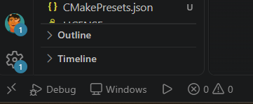

# raylib button

One button in the middle of the window; counts clicks/taps. Same `src/main.c` and `CMakeLists.txt` for all platforms (raylib 6.0 fetched automatically, see `RAYLIB_TAG` in `CMakeLists.txt`). `assets/` is available at the same path (`assets/title.txt`) everywhere.

## Build

**Windows** (Visual Studio 2022) → `build-windows/Release/raylib_button.exe`
```
cmake --preset windows
cmake --build --preset windows-release
```

**Linux** → `build-linux/raylib_button`
```
sudo apt install cmake ninja-build g++ git libx11-dev libxrandr-dev libxinerama-dev libxcursor-dev libxi-dev libgl1-mesa-dev
cmake --preset linux -DCMAKE_BUILD_TYPE=Release
cmake --build --preset linux
```

**macOS** (untested; Xcode CLT, CMake, Ninja) → `build-macos/raylib_button`
```
cmake --preset macos -DCMAKE_BUILD_TYPE=Release
cmake --build --preset macos
```

**iOS** (untested; Xcode; raylib SDL3 backend)
```
cmake --preset ios-simulator            # or ios-device -DIOS_DEVELOPMENT_TEAM=<team id>
cmake --build --preset ios-simulator
open build-ios/simulator/raylib_button.xcodeproj
```

**Web** (Docker, no local emsdk)
```
docker run --rm -v "%cd%:/src" -w /src emscripten/emsdk emcmake cmake -S . -B build-web/Release -DCMAKE_BUILD_TYPE=Release
docker run --rm -v "%cd%:/src" -w /src emscripten/emsdk cmake --build build-web/Release
cd build-web/Release && python -m http.server 8137   # http://localhost:8137/raylib_button.html
```

**Android** (SDK + NDK 25.2.9519653, JDK 17+, `ANDROID_HOME`; or Docker) → `build-android/gradle/outputs/apk/debug/app-debug.apk`
```
cd android
gradlew assembleDebug
adb install -r <apk>
```

## VS Code (F5)


Plugin: [raylib-devices.vsix](https://github.com/konyshevgmbh/raylib-vscode/releases/latest/download/raylib-devices.vsix) ([all releases](https://github.com/konyshevgmbh/raylib-vscode/releases)), install with `code --install-extension raylib-devices.vsix`. Sources: `tools/vscode-raylib-devices`.

Status bar: **Debug/Release** toggle, device picker (Windows, Chrome, Edge, Android, Wi-Fi adb, emulators), run button. F5 runs the `Debug`/`Release` entry from `launch.json` on the selected device.

Commands: **Raylib: Init**, Select Device, Toggle Debug/Release, Toggle Android Build Backend, Generate Icons, Run.

- Desktop: Windows uses `cppvsdbg`, Linux/macOS use CodeLLDB.
- Android: built locally (Gradle) or in Docker (`mingc/android-build-box`); setting `raylibDevices.androidBackend` = `auto`/`native`/`docker` (auto = local if an NDK is installed). Debug uses lldb-server + CodeLLDB; breakpoints in `main.c` work.
- Web: built in Docker (`emscripten/emsdk`; needs Docker + python). To debug in DevTools (F12), install the Chrome extension *C/C++ DevTools Support (DWARF)*.

## Raylib: Init
In an empty folder: Command Palette → **Raylib: Init**, enter a project name. Scaffolds a copy of this project (CMake, `src/`, `assets/`, `android/`, `icons/`, `web/`, `.vscode/`, `tools/gen_icons.js`, `CLAUDE.md`, `add-screen` skill), renaming `raylib_button` and the Android package. Templates: `tools/vscode-raylib-devices/templates/` — keep in sync with the root project.

## Structure
`src/main.c` (main loop, fade transitions, shared font/sound) and `src/screen_*.c` (TITLE ↔ GAMEPLAY; the button is in `screen_gameplay.c`), based on [raylib-game-template](https://github.com/raysan5/raylib-game-template) (zlib). Web page template: `web/shell.html`.

## Icons
Source: `assets/icon.png`. The rest is generated and committed (Android `mipmap-*`, `icons/icon.ico`, `ios/AppIcon.xcassets`, `icons/web/`). After changing the icon:
- VS Code: **Raylib: Generate Icons from assets/icon.png** or the **Icons: ...** tasks
- `node tools/gen_icons.js [all|android|windows|ios|web]` (plain Node.js, no dependencies)

## Plugin development
Tasks: **Plugin: Bump version**, **Plugin: Package (.vsix)**, **Plugin: Package and install**.

## CI
- `release-plugin.yml` — publishes the `.vsix` as release `v<version>` on pushes to `main` that change `tools/vscode-raylib-devices/` with a new version in `package.json`.
- `build.yml` — builds Windows, Linux, Web, Android on every push/PR; macOS 
